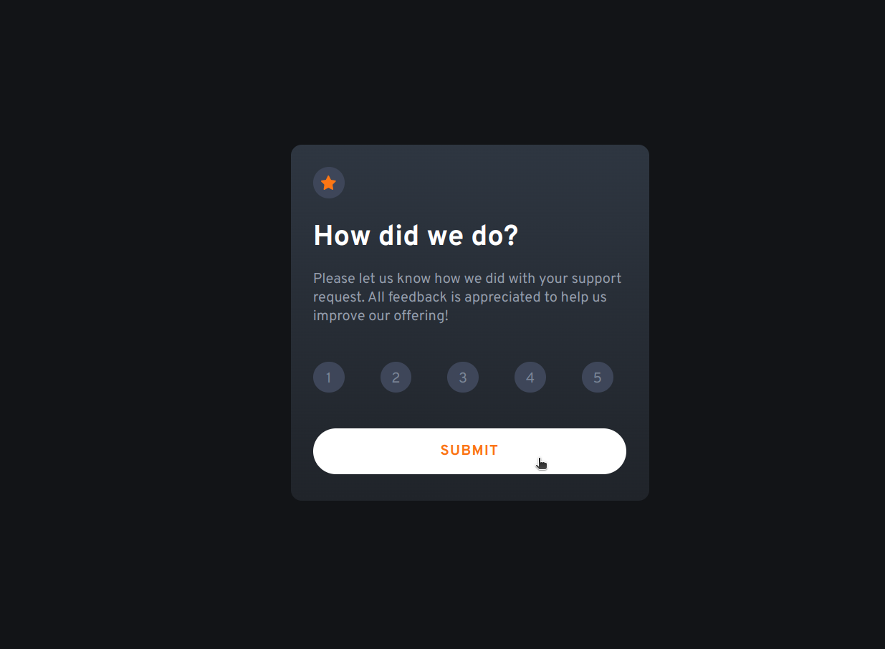

# Frontend Mentor - Interactive rating component solution

This is a solution to the [Interactive rating component challenge on Frontend Mentor](https://www.frontendmentor.io/challenges/interactive-rating-component-koxpeBUmI). Frontend Mentor challenges help you improve your coding skills by building realistic projects. 

## Table of contents

- [Overview](#overview)
  - [The challenge](#the-challenge)
  - [Screenshot](#screenshot)
  - [Links](#links)
- [My process](#my-process)
  - [Built with](#built-with)
- [Author](#author)

## Overview

### The challenge

Users should be able to:

- View the optimal layout for the app depending on their device's screen size
- See hover states for all interactive elements on the page
- Select and submit a number rating
- See the "Thank you" card state after submitting a rating

### Screenshot

### Links

- Solution URL: [Interactive rating component code](https://github.com/KelvinMvungi/interactive-rating-component-main)
- Live Site URL: [Interactive rating component site](https://interactive-rating-component-main-azure.vercel.app/)

## My process

I started with the html first to get good content layout, then I went on to styling with a mobile first approach and then the desktop and later added the small interactivity of submitting by Javascript (pure JS).

### Built with

- Semantic HTML5 markup
- CSS custom properties
- Flexbox
- CSS Grid
- Mobile-first workflow
- vanilla JS

## Author

- Frontend Mentor - [@KelvinMvungi](https://www.frontendmentor.io/profile/KelvinMvungi)
- Twitter - [@DracZihper](https://twitter.com/DracZihper)

