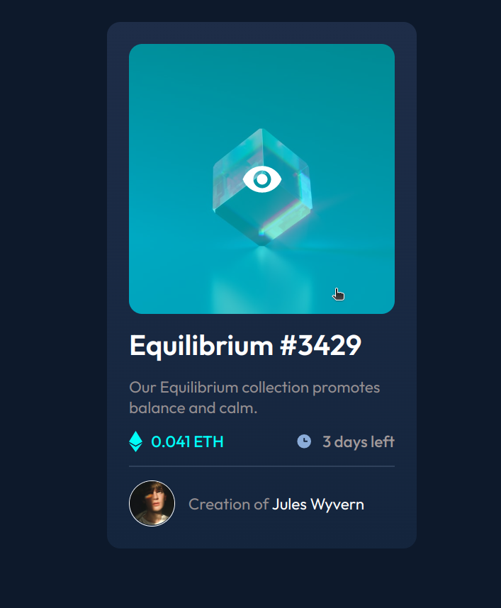

# Frontend Mentor - NFT preview card component solution

This is a solution to the [NFT preview card component challenge on Frontend Mentor](https://www.frontendmentor.io/challenges/nft-preview-card-component-SbdUL_w0U). Frontend Mentor challenges help you improve your coding skills by building realistic projects. 

## Table of contents

- [Overview](#overview)
  - [The challenge](#the-challenge)
  - [Screenshot](#screenshot)
  - [Links](#links)
- [My process](#my-process)
  - [Built with](#built-with)
  - [What I learned](#what-i-learned)
- [Author](#author)

## Overview
Challenge involves to create a cool NFT preview card with HTML, CSS plus all the tools available.

### The challenge

Users should be able to:

- View the optimal layout depending on their device's screen size
- See hover states for interactive elements

### Screenshot

### Links

- Solution URL: [Code](https://github.com/KelvinMvungi/nft-preview-card-component-main)
- Live Site URL: [Live Site](https://nft-preview-card-component-main-xi-lime.vercel.app/)

## My process
Created an empty local repository then initialized it to github and added the challenge files. Started working with HTML and then the CSS. This challenge is done with only HTML5 and CSS3 no additional libraries, preprocessors, frameworks.

### Built with

- Semantic HTML5 markup
- CSS custom properties
- Flexbox
- CSS Grid
- Mobile-first workflow

### What I learned

I learnt a lot especially in the styling with being able to set the overlay of the view image (it was pretty challenging). 

## Author

- Frontend Mentor - [@KelvinMvungi](https://www.frontendmentor.io/profile/KelvinMvungi)
- Twitter - [@DracZihper](https://twitter.com/DracZihper)

