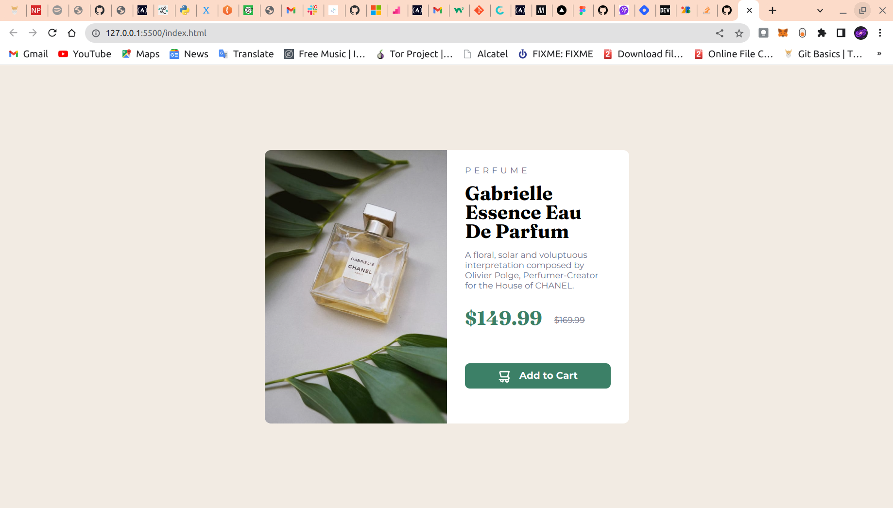
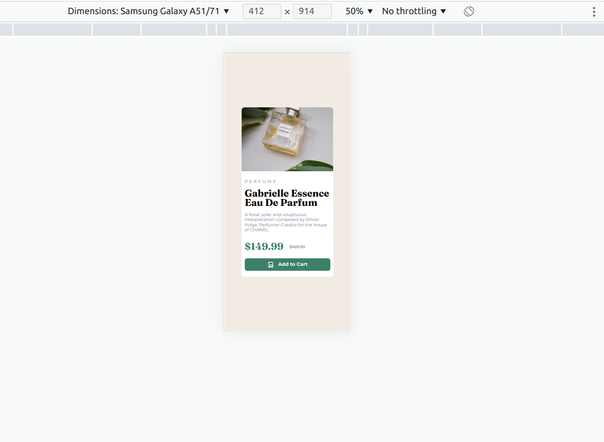

# Frontend Mentor - Product preview card component solution

This is a solution to the [Product preview card component challenge on Frontend Mentor](https://www.frontendmentor.io/challenges/product-preview-card-component-GO7UmttRfa). Frontend Mentor challenges help you improve your coding skills by building realistic projects. 

## Table of contents

- [Overview](#overview)
  - [The challenge](#the-challenge)
  - [Screenshot](#screenshot)
  - [Links](#links)
- [My process](#my-process)
  - [Built with](#built-with)
  - [What I learned](#what-i-learned)
  - [Continued development](#continued-development)
  - [Useful resources](#useful-resources)
- [Author](#author)
- [Acknowledgments](#acknowledgments)

## Overview

### The challenge

Users should be able to:

- View the optimal layout depending on their device's screen size
- See hover and focus states for interactive elements

### Screenshot

 FOR DESKTOP DESIGN
 FOR MOBILE DESIGN

### Links

- Solution URL: [(https://github.com/KelvinMvungi/product-preview-card-component-main)]
- Live Site URL: [(https://kelvinmvungi.github.io/product-preview-card-component-main/)]

## My process

Started with the HTML first, and moved on to the styling with mobile first approach. After that I did the desktop design and everything was looking good and responsive.

### Built with

- Semantic HTML5 markup
- CSS custom properties
- Flexbox
- CSS Grid
- Media query

### What I learned

What I learned in this section is cool new ways to create and initialize a repository from command line plus recap of all the basic stuffs of HTML and CSS.

### Useful resources

- [(https://developer.mozilla.org/en-US/docs/Web/HTML)] - This helped me for some HTML markup. I really liked this pattern and will use it going forward.
- [(https://www.w3schools.com/css)] - This is an amazing article which helped me finally understand center items. I'd recommend it to anyone still learning this concept.

