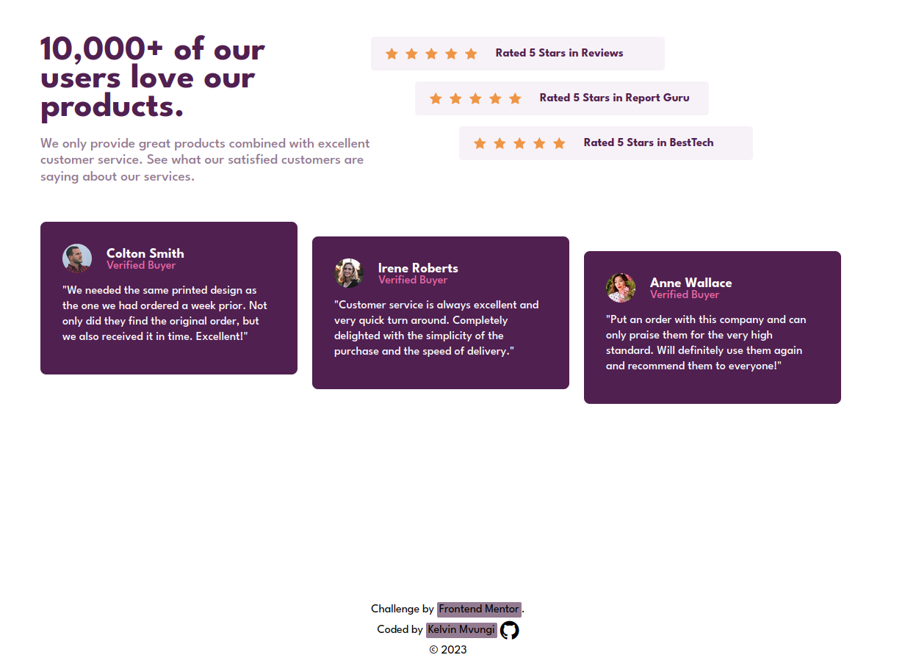
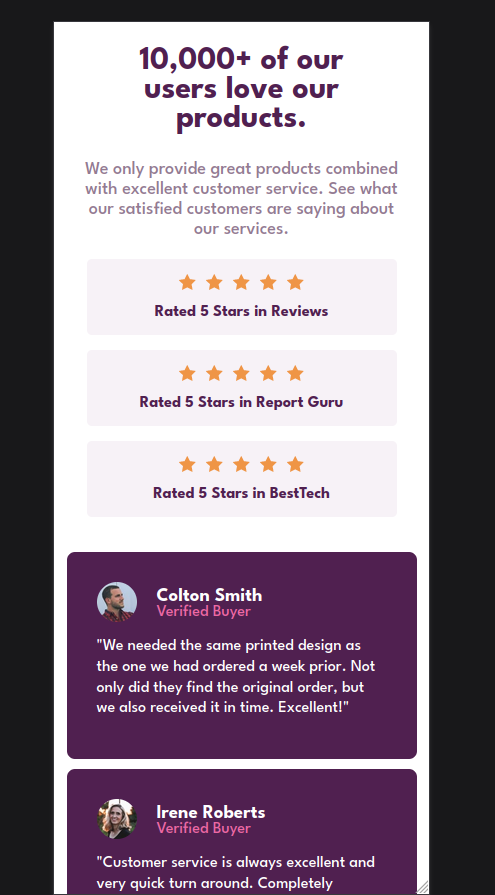
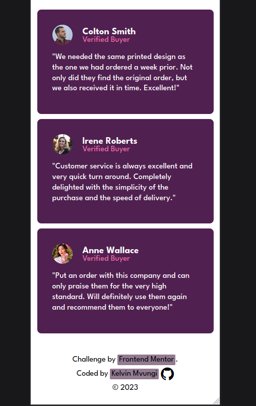

# Frontend Mentor - Social proof section solution

This is a solution to the [Social proof section challenge on Frontend Mentor](https://www.frontendmentor.io/challenges/social-proof-section-6e0qTv_bA). Frontend Mentor challenges help you improve your coding skills by building realistic projects.

- [Overview](#overview)
  - [The challenge](#the-challenge)
  - [Screenshot](#screenshot)
  - [Links](#links)
- [My process](#my-process)
  - [Built with](#built-with)
  - [What I learned](#what-i-learned)
  - [Useful resources](#useful-resources)
- [Author](#author)
- [Acknowledgments](#acknowledgments)

## Overview

### The challenge

Users should be able to:

- View the optimal layout for the section depending on their device's screen size

### Screenshot





### Links

- Solution URL: [Source Code](https://github.com/KelvinMvungi/challenges-FrontendMentor/tree/main/social-proof-section)
- Live Site URL: [Live site](https://resplendent-marshmallow-42c190.netlify.app/)


## My process
Started with HTML then CSS using mobile first approach then desktop

### Built with

- Semantic HTML5 markup
- CSS custom properties
- Flexbox

### What I learned

I learned mostly about positioning items in a page.

```css
{
    position: absolute;
    bottom: 0;
}
    
```

## Author

- Frontend Mentor - [@kelvinmvungi](https://www.frontendmentor.io/profile/kelvinmvungi)
- Twitter - [@DracZihper](https://www.twitter.com/DracZihper)

## Acknowledgment

People who created and maintain [The Odin Project](https://www.theodinproject.com/)